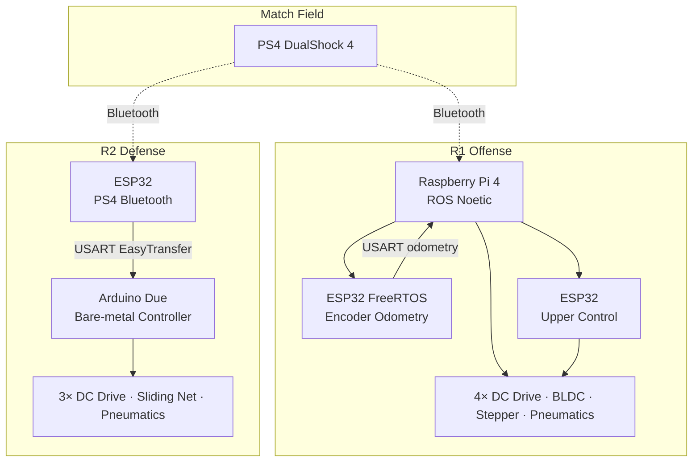
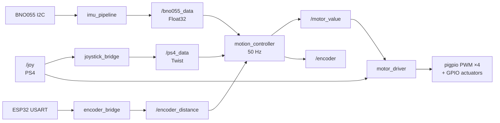
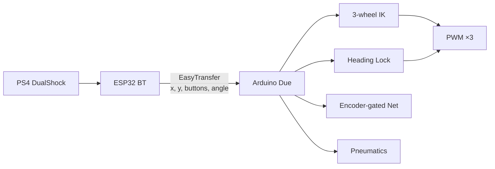

# Robocon 2025 — Robot Basketball

[](http://wiki.ros.org/noetic)
[](https://www.python.org/)
[](https://www.espressif.com/)
[](https://www.raspberrypi.com/)
[](LICENSE)

> **ABU Robocon 2025** — India National Round  
> Dual-robot software stack for competitive Robot Basketball: ROS-based offense and bare-metal defense.

---

## Abstract

This repository presents the complete software and firmware architecture developed for an ABU Robocon 2025 *Robot Basketball* entry. The competition requires two complementary robots: an **offense robot (R1)** that dribbles and shoots, and a **defense robot (R2)** that blocks opposing scores.

**R1** runs ROS Noetic on a Raspberry Pi 4. Five Python nodes implement field-centric teleoperation, dual-stage IMU filtering (median + exponential LPF), active heading-lock PID at 50 Hz, and 4-wheel omnidirectional inverse kinematics. Low-level odometry is offloaded to an ESP32 FreeRTOS task that samples three quadrature encoders at 100 Hz and streams world-frame pose to the Pi over USART. Upper-mechanism actuation (BLDC shooter, stepper aiming, pneumatic dribbler) is coordinated by a dedicated ESP32.

**R2** runs entirely bare-metal on an Arduino Due. An ESP32 forwards PS4 DualShock state via EasyTransfer; the Due executes 3-wheel omni inverse kinematics, proportional heading lock, encoder-gated sliding-net deployment, and pneumatic support in a single deterministic control loop.

Both platforms share the design principle of *shared autonomy*: the driver commands field velocity and a heading target, while onboard IMU feedback continuously corrects rotational drift. This reduces cognitive load under match pressure and improves shot alignment and defensive positioning.

**Keywords:** ABU Robocon, omnidirectional drive, inverse kinematics, ROS Noetic, FreeRTOS, active heading lock, field-centric drive, BNO055, Arduino Due, ESP32

---

## Robots at a Glance

| | **R1 — Offense** | **R2 — Defense** |
|---|---|---|
| Role | Dribble & shoot | Block opposing robot |
| Drive | 4-wheel omni (45°) | 3-wheel omni (120°) |
| Compute | Raspberry Pi 4 — ROS Noetic | Arduino Due — bare-metal |
| Sensing | BNO055 (I2C) + ESP32 encoder odometry | Gyro angle via EasyTransfer |
| Actuation | Drive motors, BLDC shooter, stepper aim, pneumatics | Drive motors, sliding net, pneumatics |
| Shared autonomy | Active heading lock (PI, 50 Hz) | Active heading lock (P control) |

---

## System Architecture

### High-level overview



### R1 — ROS dataflow



### R2 — Bare-metal loop



> Detailed block diagrams, control math, and pin maps: **[docs/ARCHITECTURE.md](docs/ARCHITECTURE.md)** · **[docs/CONTROL_SYSTEMS.md](docs/CONTROL_SYSTEMS.md)** · **[docs/HARDWARE.md](docs/HARDWARE.md)**

---

## Key Technical Contributions

### Active Heading Lock

Teleoperation with automatic rotational correction. The right stick sets a heading target; a 50 Hz PI loop injects corrective ω into wheel speeds so the driver focuses on translation only.

```
error = wrap(target − yaw) ∈ [−180°, 180°]
ω     = Kp · error + Ki · ∫ error dt
        (R1: Kp = 3.0, Ki = 0.05; R2: P-only, Kp = 1.5)
```

### Field-Centric Drive (R1)

Joystick axes are interpreted in the field frame. Before IK, velocity is rotated into the body frame using filtered IMU yaw:

```python
vx_body =  vx_world * cos(yaw) + vy_world * sin(yaw)
vy_body = -vx_world * sin(yaw) + vy_world * cos(yaw)
```

### Inverse Kinematics

**R1 — 4-wheel omni (45° mounting)**

```
K = 1/(2√2) ≈ 0.3536    L_R = 0.09/0.075 = 1.2

ω₁ = K(−vx + vy) + L_R·ω     # front-left
ω₂ = K(−vx − vy) + L_R·ω     # front-right
ω₃ = K( vx − vy) + L_R·ω     # rear-left
ω₄ = K( vx + vy) + L_R·ω     # rear-right
```

**R2 — 3-wheel omni (120°)**

```
ω₁ = (−2vx/3)              + ω/3
ω₂ = ( vx/3) + (vy/√3)     + ω/3
ω₃ = ( vx/3) − (vy/√3)     + ω/3
```

Outputs are proportionally scaled so the fastest wheel saturates at PWM 255 without distorting the velocity ratio.

### FreeRTOS Encoder Odometry (R1)

ESP32 Core 0 runs a 100 Hz task reading three quadrature encoders. Differential X-encoders estimate heading; body-frame deltas are integrated into world-frame pose and streamed to the Pi via EasyTransfer.

### Sliding Net (R2)

DC motor + quadrature encoder deploys the blocking net. Rising-edge on Triangle starts travel; motor stops at 700 ticks — no limit switch required.

---

## Repository Structure

```
robocon-2025/
├── README.md                          # This file
├── LICENSE                            # MIT
├── CONTRIBUTING.md
├── CITATION.cff
├── requirements.txt                   # Python / ROS node dependencies
├── docs/
│   ├── ARCHITECTURE.md                # System & ROS graphs
│   ├── CONTROL_SYSTEMS.md             # PID, IK, filters
│   └── HARDWARE.md                    # BOM-style hardware map
│
├── r1_offense/
│   ├── ros_ws/
│   │   ├── motion_controller.py       # Field-centric + heading PI + 4-wheel IK
│   │   ├── imu_pipeline.py            # BNO055 → yaw → median + LPF
│   │   ├── motor_driver.py            # pigpio PWM + actuator GPIO
│   │   ├── joystick_bridge.py         # /joy → /ps4_data Twist
│   │   └── encoder_bridge.py          # USART → /encoder_distance
│   └── firmware/
│       ├── esp32_odometry_rtos/       # FreeRTOS encoder odometry
│       └── upper_control/             # BLDC + stepper + pneumatics
│
└── r2_defense/
    └── firmware/
        └── due_omni_controller/       # Full bare-metal R2 firmware
```

---

## Getting Started

### Prerequisites

| Component | Requirement |
|---|---|
| R1 compute | Raspberry Pi 4, ROS Noetic, Python 3.8+ |
| R1 MCU | ESP32 DevKit (Arduino core + FreeRTOS) |
| R2 MCU | Arduino Due + ESP32 (PS4 bridge) |
| Controller | PS4 DualShock 4 (Bluetooth) |

### Python dependencies (R1)

```bash
pip install -r requirements.txt
sudo pigpiod   # start pigpio daemon before motor_driver.py
```

### Launch R1 (six terminals / one launch file of your choice)

```bash
# Flash esp32_odometry_rtos.ino and upper_control.ino first

rosrun robocon_node imu_pipeline.py
roslaunch joy joy.launch
rosrun robocon_node joystick_bridge.py
rosrun robocon_node encoder_bridge.py
rosrun robocon_node motor_driver.py
rosrun robocon_node motion_controller.py
```

### Launch R2

Flash `r2_defense/firmware/due_omni_controller/due_omni_controller.ino` to the Arduino Due and the companion ESP32 PS4 bridge. No ROS required.

---

## Dependencies

**ROS / Python**

| Package | Role |
|---|---|
| `rospy`, `sensor_msgs`, `geometry_msgs`, `std_msgs` | ROS Noetic messaging |
| `pigpio` | Hardware PWM & GPIO |
| `adafruit-circuitpython-bno055` | BNO055 IMU |
| `pyserial` | USART encoder bridge |

**Firmware libraries**

| Library | Role |
|---|---|
| EasyTransfer | Structured USART packets |
| ESP32Encoder / Encoder | Quadrature decoding |
| ESP32Servo | ESC PWM (50 Hz) |
| PS4Controller | DualShock Bluetooth (ESP32) |

---

## Documentation

| Document | Contents |
|---|---|
| [docs/ARCHITECTURE.md](docs/ARCHITECTURE.md) | Layered architecture, ROS graph, USART protocols |
| [docs/CONTROL_SYSTEMS.md](docs/CONTROL_SYSTEMS.md) | Heading lock, filters, IK derivations |
| [docs/HARDWARE.md](docs/HARDWARE.md) | Compute, sensors, actuators, pinouts |

---

## Author Contributions

- Full **ROS software stack for R1** (five Python nodes)
- **Active heading lock** — PI design, IMU signal chain, tuning
- **Field-centric drive** — yaw-based world→body transform
- **4-wheel and 3-wheel omni IK** in Python (ROS) and C++ (Due)
- **FreeRTOS ESP32 odometry** — dedicated-core 100 Hz encoder task
- **Upper-control firmware** — BLDC ESC, closed-loop stepper, pneumatics
- **USART EasyTransfer** layer across MCUs
- **R2 defense firmware** — bare-metal Due controller + encoder-gated net

---

## Citation

If you reference this work, please cite:

```bibtex
@software{robocon2025_basketball,
  title   = {Robocon 2025 Robot Basketball: Dual-Robot Control Software},
  year    = {2025},
  url     = {https://github.com/<your-org>/robocon-2025},
  note    = {ABU Robocon 2025 — India National Round}
}
```

Or use the machine-readable [`CITATION.cff`](CITATION.cff).

---

## License

Released under the [MIT License](LICENSE).

---

*ABU Robocon 2025 — India National Round*
